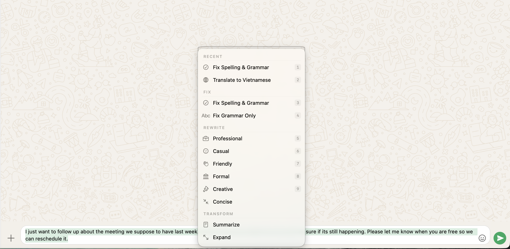
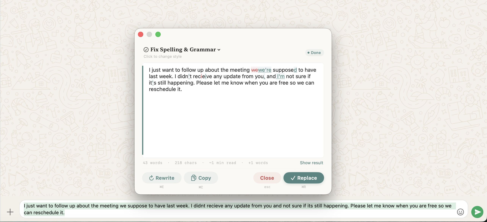

<p align="center">
  
</p>

<h1 align="center">Poli</h1>

<p align="center">
  <strong>AI-powered writing tools that work in every app.</strong><br>
  100% on-device. Free. Private. No API keys.
</p>

<p align="center">
  <a href="#features">Features</a> &bull;
  <a href="#installation">Installation</a> &bull;
  <a href="#usage">Usage</a> &bull;
  <a href="#building-from-source">Build</a> &bull;
  <a href="#contributing">Contributing</a> &bull;
  <a href="#license">License</a>
</p>

<p align="center">

https://github.com/user-attachments/assets/3b20d222-a9f5-49c5-ab48-9fc1b399b331


  <video src="https://github.com/user-attachments/assets/demo1080.mov" width="720" autoplay loop muted></video>
</p>

---

Poli is a lightweight macOS menu bar app that gives you system-wide writing tools — proofread, rewrite, summarize, translate, and more — powered entirely by Apple's on-device Foundation Models. It works in **every app**, including Electron apps like Slack, Teams, Discord, and WhatsApp.

## Features

**Fix**
- Proofread & fix spelling and grammar
- Diff view showing exactly what changed

**Rewrite**
- Professional, Casual, Friendly, Formal, Creative, Concise

**Transform**
- Summarize, Expand, Key Points

**Translate**
- Spanish, French, German, Chinese (Simplified), Japanese, Korean

**Custom Prompts**
- Save up to 10 custom writing instructions for quick reuse

### What makes Poli different

- **Completely on-device** — Uses Apple Foundation Models. Zero cost, total privacy, works offline.
- **Works everywhere** — Including Electron apps (Teams, Slack, Discord) via Accessibility API + paste fallback.
- **Keyboard-shortcut-first** — Select text, press the hotkey, pick a style. No right-click menus.
- **Tone detection** — Detects the tone of your text before rewriting so you can make an informed choice.
- **Context-aware suggestions** — Automatically detects if you're writing an email, chat message, code comment, etc. and suggests relevant styles.
- **History** — Browse and reuse past transformations.
- **Customizable hotkey** — Change the global shortcut to whatever you prefer.

## Requirements

- macOS 26.0 or later
- Apple Silicon Mac

## Installation

### Download

Download the latest `.dmg` from the [Releases](../../releases) page.

### Homebrew (coming soon)

```bash
brew install --cask poli
```

## Usage

1. **Grant Accessibility permission** — Poli needs this to read selected text and replace it. You'll be prompted on first launch.
2. **Select text** in any app.
3. **Press the hotkey** (default: `Control + Option + C`).
4. **Pick a writing style** from the popup.
5. **Review the result** and click Replace (`Cmd + R`) or close with `Esc`.

<p align="center">
  
  <br><em>Pick a writing style — recent styles appear at the top</em>
</p>

<p align="center">
  
  <br><em>Review changes with word-level diff before replacing</em>
</p>

You can also access Poli from the menu bar icon or via **Services** (right-click > Services).

## Building from Source

Poli uses [XcodeGen](https://github.com/yonaskolb/XcodeGen) to generate the Xcode project.

```bash
# Install XcodeGen if you haven't
brew install xcodegen

# Clone the repo
git clone https://github.com/luchi0208/Poli.git
cd poli

# Generate Xcode project
xcodegen generate

# Open in Xcode
open WritingAssistant.xcodeproj
```

Build and run the `WritingAssistant` scheme targeting macOS.

> **Note:** Accessibility permission is tied to the binary path. Replacing the `.app` bundle revokes it and requires re-granting in System Settings > Privacy & Security > Accessibility.

- **App Sandbox disabled** — required for cross-app Accessibility API access and CGEvent posting.

## Contributing

Contributions are welcome! Please open an issue first to discuss what you'd like to change.

1. Fork the repo
2. Create your feature branch (`git checkout -b feature/my-feature`)
3. Commit your changes
4. Push to the branch (`git push origin feature/my-feature`)
5. Open a Pull Request

## License

[MIT](LICENSE) &copy; 2026 Luan Nguyen

